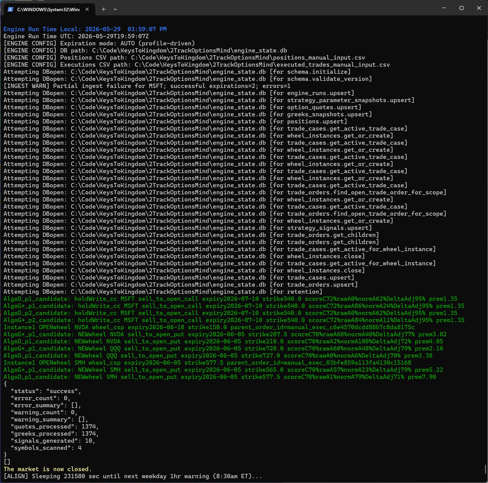

# 2TrackOptionsMind

Local, rules-driven holdWrite options decision engine for conservative covered calls and Wheel strategies (QQQ/NVDA, etc), designed for individual traders who want deterministic, auditable, and manual execution with Excel integration.

---

## Project Summary

2TrackOptionsMind is a local-first Python engine for:

- holdWrite Conservative covered call management on old, long, low-basis, high-tax implication share positions (assignment avoidance) for income generation above/beyond dividends and appreciation
- Wheel strategy automation for arbitrary tickers eg. QQQ/NVDA/SMH (assignment allowed)
- Manual trade execution, with all signals and analytics surfaced in Excel

---

## Key Features & Goals

- Deterministic, rules-driven signal generation (no cloud dependency)
- Excel/PowerQuery integration for dashboards and scenario modeling
- SQLite-based state and audit trail
- Console rendered guidance per strategy, lane, instance, algorithm, profile with optional scoring (per following screenshot)
- Pluggable alerting hooks in place on signals actions: roll, close, avoid_assignment, optimize_dividend_capture in pipeline.py:543 (aspirational: email, Pushover, Teams-- NYI)
- All operational data and secrets externalized (never in repo)
- Manual execution at your brokerage (no auto-trading)

Console Output example:

---

## Quick Start

### Folder Structure

| Folder/File                   | Purpose                                |
| ----------------------------- | -------------------------------------- |
| src/                          | Python application source              |
| src/engine/                   | Engine orchestration logic             |
| src/engine/main.py            | Canonical engine entrypoint            |
| src/strategies/               | Strategy-specific logic                |
| src/strategies/hold_write_cc/ | HoldWrite covered-call rules           |
| src/strategies/wheel/         | Wheel rules for QQQ/NVDA/etc           |
| src/strategies/shared/        | Shared abstractions and helpers        |
| tests/                        | Unit and integration tests             |
| config/                       | Environment and runtime config         |
| docs/                         | Design notes, runbooks, and specs      |
| data/                         | Local runtime data (DB, exports, logs) |
| scripts/                      | Utility scripts for setup/maintenance  |

### Install & Setup

1. Clone the repo and review the folder structure above.
2. Set up your external ops root and secrets (see [Operational Artifacts](#operational-artifacts)).
3. Configure your Tradier (or other) API token as described in [docs/tradier_account_setup.md](ACCESS.md).
4. Review the [Operator Run Guide](ACCESS.md) for startup, shutdown, and scheduler instructions.

### Run/Start/Stop

- See [docs/system_startup_shutdown_run_guide_v1.md](ACCESS.md) for all operational commands and troubleshooting.

---

## Data Providers

- **Tradier** (primary): [Open account with referral link (3 months free)](https://trade.tradier.com/raf-open/?mwr=b999629c)
- See [docs/tradier_account_setup.md](ACCESS.md) for setup and alternatives.

---

## Operational Artifacts

- **All live data, secrets, and config are externalized** to a canonical ops root defined in a keys_root_path.txt (e.g., `C:/<yourPreferredLocalPath>/2TrackOptionsMind`).
- The private repo never contains live credentials or operational data.
- See [docs/config_governance_v1.md](ACCESS.md) for details.

---

## Documentation Index

- [5kFt Plan Overview](5kFtCurrentOverview.md)  (this link actually works in this public repo v. other redirs to ACCESS.md)
- [Operator Run Guide](ACCESS.md)
- [Data Contracts & Specs](ACCESS.md)
- [Configuration Governance](ACCESS.md)
- [10kFt Initial Plan Overview](ACCESS.md)
- [License](LICENSE.md)

---

## Governance & License

- Licensed under PolyForm Noncommercial 1.0.0 with a personal trading exception (see [LICENSE.md](LICENSE.md)).
- All operational and configuration governance is documented in [docs/config_governance_v1.md](ACCESS.md).
